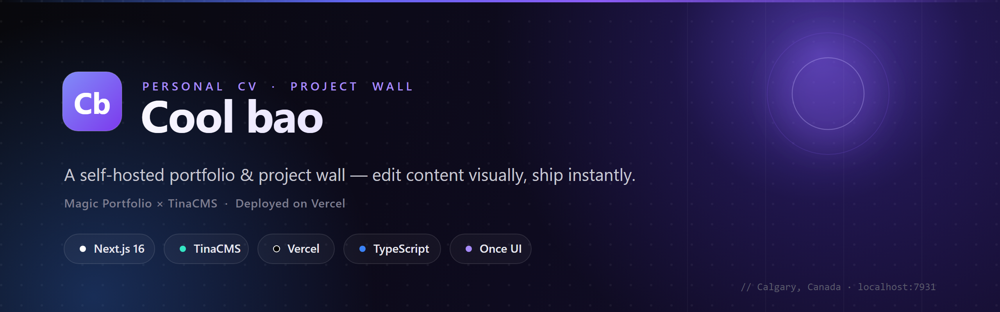
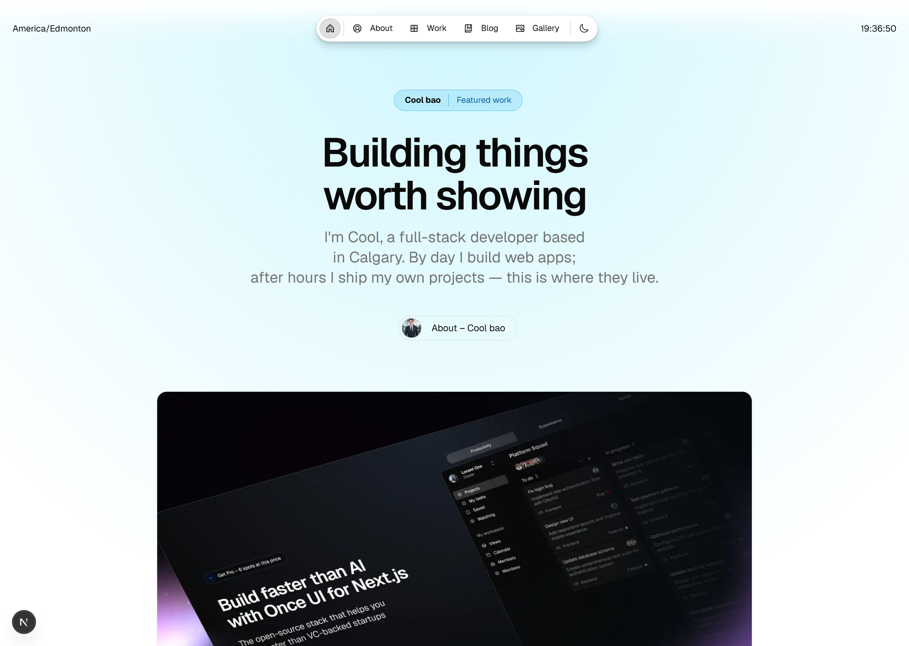
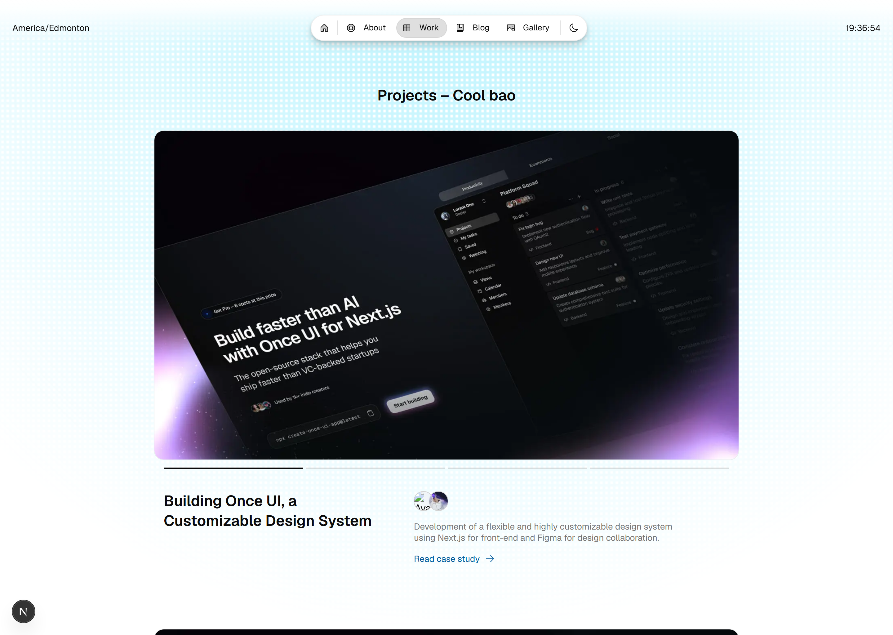
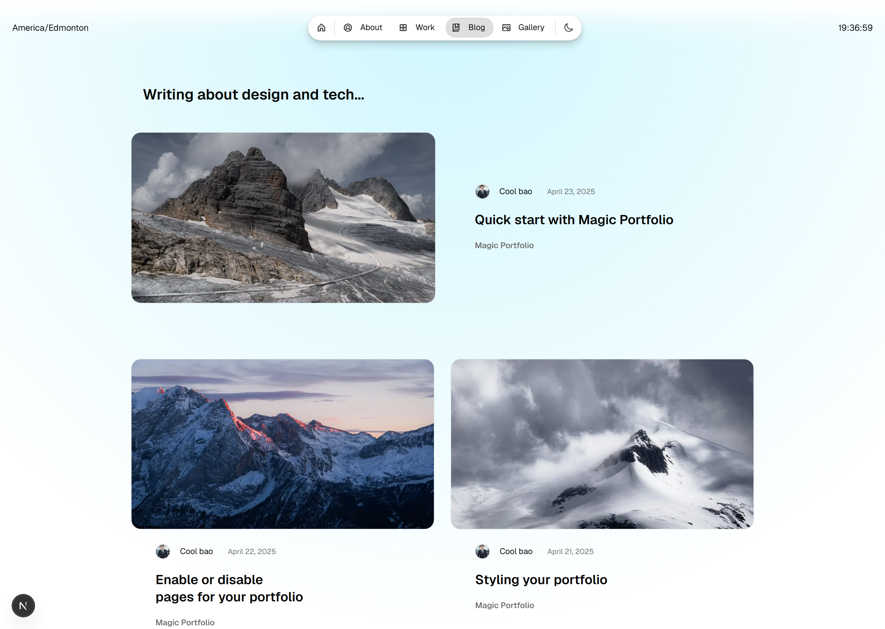
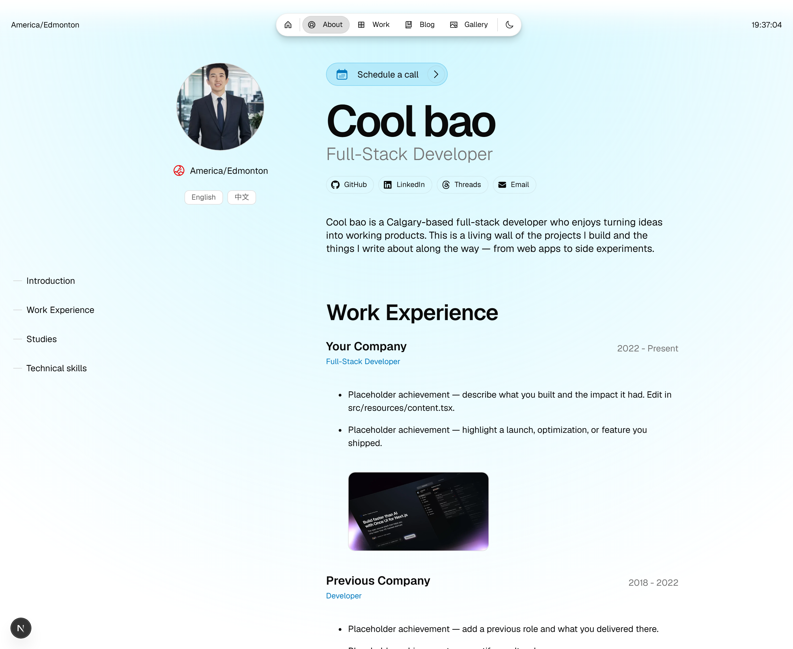
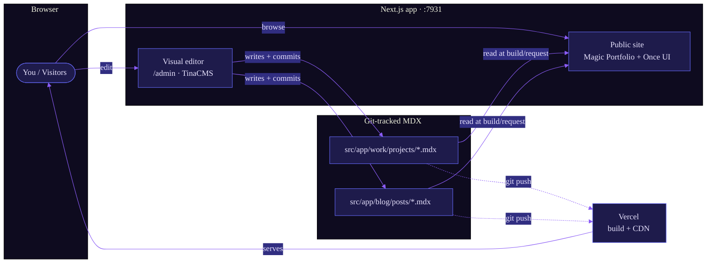
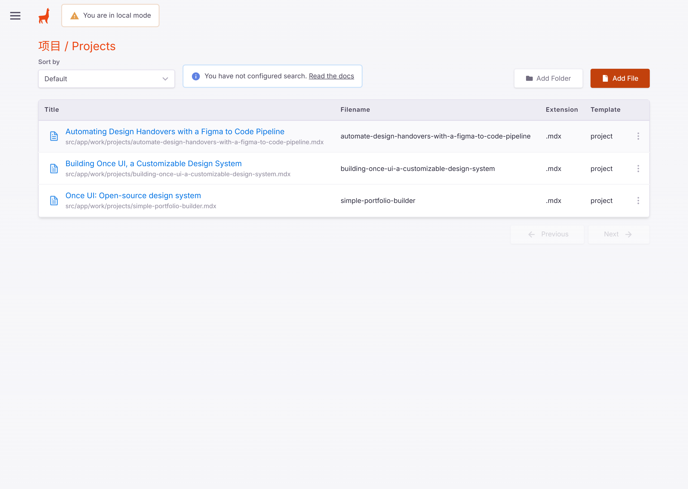
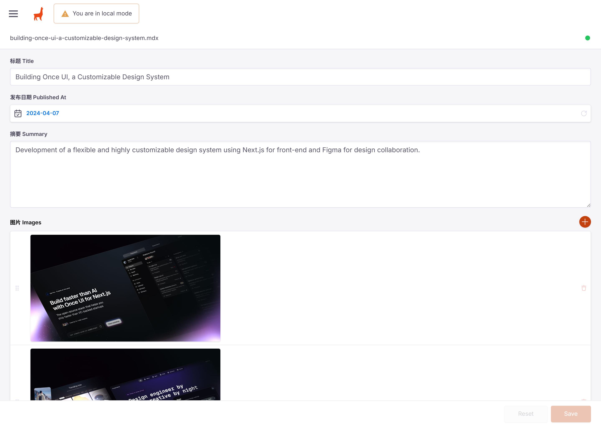
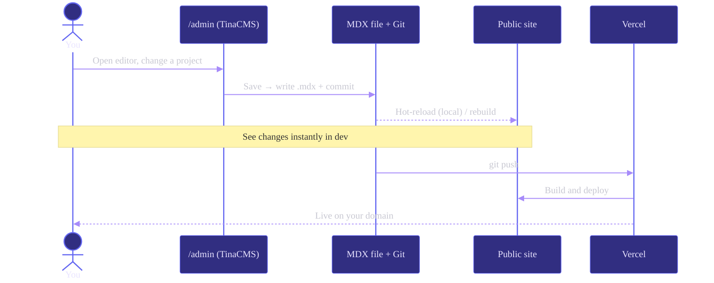

<div align="center">



<br/>

[](https://nextjs.org/)
[](https://tina.io/)
[](https://vercel.com/)
[](https://www.typescriptlang.org/)
[](https://react.dev/)

**A self-hosted personal CV & project wall — edit content visually, ship instantly.**

Frontend powered by [Magic Portfolio](https://github.com/once-ui-system/magic-portfolio) · Content managed by [TinaCMS](https://tina.io) · Deployed on [Vercel](https://vercel.com)

</div>


## Overview

This is a developer portfolio built as a **living project wall**. The twist: instead of editing Markdown files by hand, every project and blog post is managed through a polished **visual editor at `/admin`** — yet the content stays as plain MDX in the repo, version-controlled by Git and rendered statically for speed and SEO.

> **One source of truth, two views.** The same MDX files power both the public site and the visual editor. Edit in the admin → the file updates and commits → the site updates. No database, no lock-in.

- **Visual CMS, file-based storage** — TinaCMS gives you a Notion-like editor; content lives as MDX in `src/app/**`.
- **Instant, SEO-friendly frontend** — Next.js 16 App Router + Once UI, fully static where it counts.
- **Git-native workflow** — every edit is a commit; push to deploy.
- **Zero-config deploys** — ships to Vercel out of the box.


## Live Preview

<div align="center">



<em>Homepage — hero, intro, and featured work</em>

</div>

<br/>

<table>
  <tr>
    <td width="50%"></td>
    <td width="50%"></td>
  </tr>
  <tr>
    <td align="center"><em>/work — the project wall</em></td>
    <td align="center"><em>/blog — writing &amp; notes</em></td>
  </tr>
  <tr>
    <td colspan="2"></td>
  </tr>
  <tr>
    <td colspan="2" align="center"><em>/about — CV, experience &amp; skills</em></td>
  </tr>
</table>


## Architecture



The public site and the CMS are the **same Next.js app**. TinaCMS doesn't store content in a database — it reads and writes the very MDX files that the frontend renders. That keeps everything in Git and makes deploys deterministic.


## Editing Content via `/admin`

Open **`http://localhost:7931/admin`** (or `your-domain.com/admin` in production). You get a full visual editor — no Markdown required.

<div align="center">

<em>Collections — every project &amp; post in one place, stored as <code>.mdx</code></em>
</div>

<br/>

<div align="center">

<em>Visual editor — title, date, summary, images, and rich-text body</em>
</div>

### The edit-to-live loop



**In short:** edit in the browser → file is written and committed → `push` → Vercel rebuilds and ships. Locally, changes hot-reload immediately.

### Field reference

<table>
<tr><th align="left">Projects — <code>src/app/work/projects/*.mdx</code></th><th align="left">Blog — <code>src/app/blog/posts/*.mdx</code></th></tr>
<tr valign="top"><td>

| Field | Key |
|---|---|
| 标题 Title | `title` |
| 发布日期 Published At | `publishedAt` |
| 摘要 Summary | `summary` |
| 图片 Images | `images[]` |
| 团队 Team | `team[]` |
| 外部链接 Link | `link` |
| 正文 Body | MDX body |

</td><td>

| Field | Key |
|---|---|
| 标题 Title | `title` |
| 副标题 Subtitle | `subtitle` |
| 摘要 Summary | `summary` |
| 封面图 Cover | `image` |
| 发布日期 Published At | `publishedAt` |
| 标签 Tag | `tag` |
| 正文 Body | MDX body |

</td></tr>
</table>

The collection schema lives in [`tina/config.ts`](tina/config.ts).


## Deployment on Vercel

The whole project deploys to Vercel with zero configuration.

```bash
npm i -g vercel
vercel            # preview deployment
vercel --prod     # production
```

| Setting | Value |
|---|---|
| Framework preset | Next.js |
| Build command | `npm run build` (`tinacms build && next build`) |
| Output | `.next` (automatic) |
| Node version | 20+ |

> **Going multi-user / remote editing?** Local mode edits the filesystem on the machine running `npm run dev`. To let editors update content from anywhere (and from the production `/admin`), connect a free [Tina Cloud](https://app.tina.io) project and set `NEXT_PUBLIC_TINA_CLIENT_ID`, `TINA_TOKEN`, and `NEXT_PUBLIC_TINA_BRANCH` in your Vercel env vars.


## Tech Stack

| Layer | Technology |
|---|---|
| Framework | Next.js 16 (App Router, Turbopack) |
| UI system | [Once UI](https://once-ui.com) + SCSS |
| Language | TypeScript 5 · React 19 |
| Content | MDX + gray-matter |
| CMS | TinaCMS 3 (Git-backed, local mode) |
| Hosting | Vercel |


## Getting Started

```bash
# 1. Install
npm install

# 2. Run dev (TinaCMS + Next.js together)
npm run dev
```

| URL | What |
|---|---|
| http://localhost:7931 | Public site |
| http://localhost:7931/admin | Visual content editor |

Useful scripts:

```bash
npm run dev        # TinaCMS dev server + Next on :7931
npm run dev:next   # Next only, no CMS
npm run build      # tinacms build && next build
npm run start      # serve production build on :7931
```

> Ports use the **793x** range to avoid local conflicts.


## Project Structure

```
.
├─ src/
│  ├─ app/
│  │  ├─ work/projects/*.mdx   # ← project wall content
│  │  ├─ blog/posts/*.mdx      # ← blog content
│  │  ├─ about/                # CV / résumé page
│  │  └─ ...                   # home, gallery, api, layout
│  ├─ components/              # Once UI components
│  └─ resources/
│     ├─ content.tsx           # ← your name, role, socials, copy
│     └─ once-ui.config.ts     # theme, colors, fonts, baseURL
├─ tina/
│  └─ config.ts                # ← CMS collections & fields
├─ public/images/              # media (avatar, covers, gallery)
└─ next.config.mjs
```

**To make it yours:** edit your identity (name, role, socials, intro) in [`src/resources/content.tsx`](src/resources/content.tsx), tweak theme and `baseURL` in [`src/resources/once-ui.config.ts`](src/resources/once-ui.config.ts), then manage projects & posts from `/admin`.


## Credits

- Frontend template — [Magic Portfolio](https://github.com/once-ui-system/magic-portfolio) by Once UI (CC BY-NC 4.0)
- Content management — [TinaCMS](https://github.com/tinacms/tinacms)

<div align="center">
<br/>
<sub>Built by <strong>Cool bao</strong> · Calgary, Canada</sub>
</div>
